# WEB-APIから統計情報を取得してCSV出力
家計調査から単身世帯の年間のコメ消費量(金額)を取得してCSV出力

<br>

## 1. APIリクエストURL確認
サイトから目的の情報のAPI確認を行う

<br>

### 1.1. トップーページから分野を選択
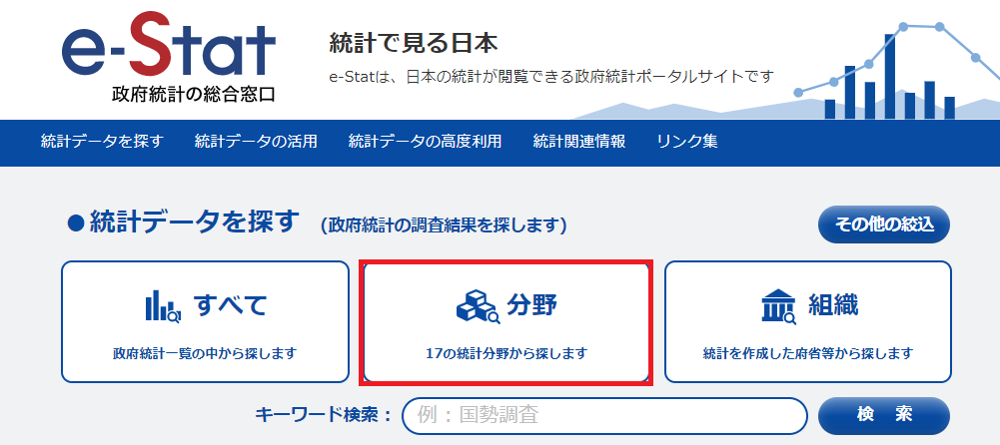

<br>

### 1.2. 遷移先画面を下スクロール
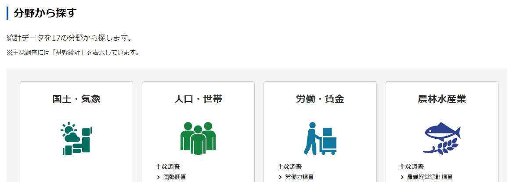

<br>

### 1.3. 企業・家計・経済から家計調査を選択
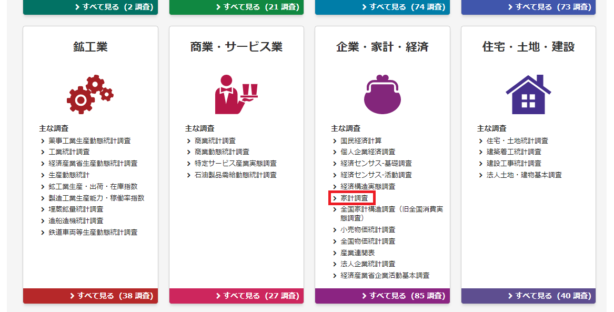

<br>

### 1.4. 家計調査のデータベースを選択
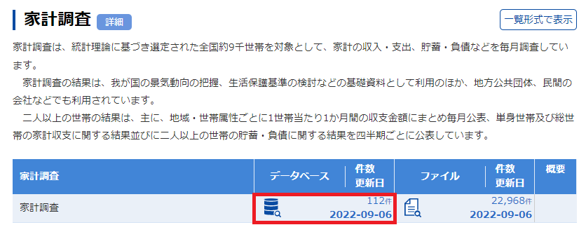

<br>

### 1.5. 遷移先画面を下スクロール
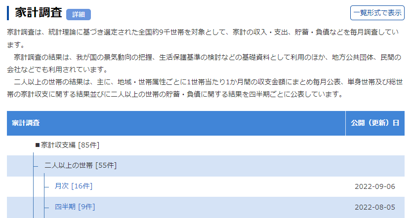

<br>

### 1.6. 単身世帯の年次ボタン押下
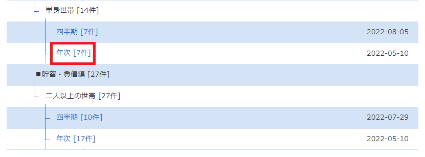

<br>

### 1.7. 品目分類の2020年改定のDBボタン押下
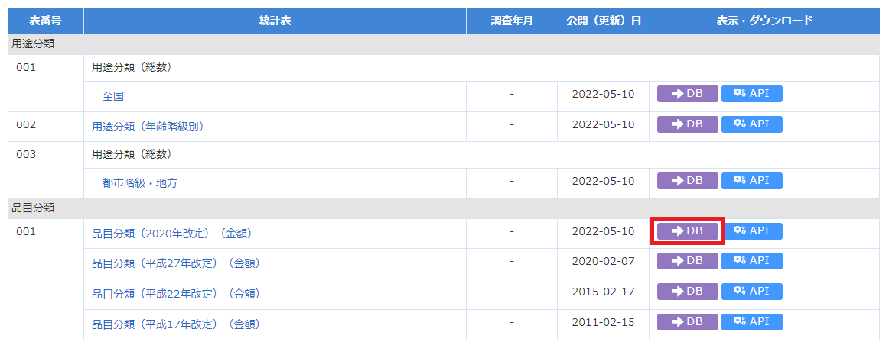

<br>

### 1.8. 表示項目選択タブ押下
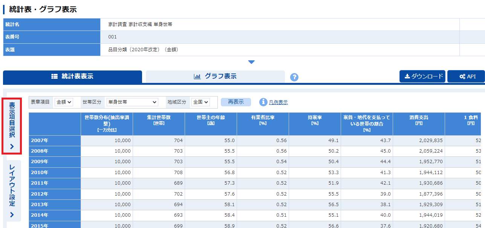

<br>

### 1.9. 表示項目をコメに限定するため品目分類の項目選択ボタン押下
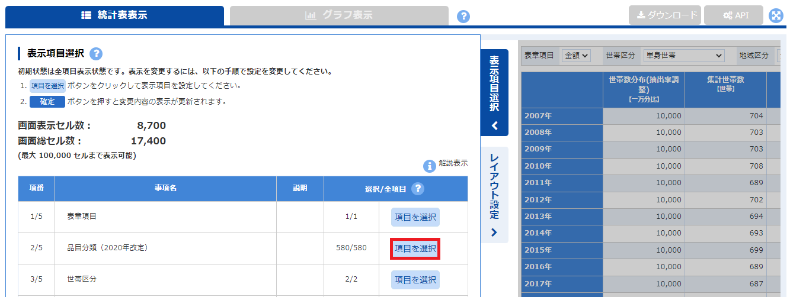

<br>

### 1.10. 全解除ボタン押下で一度リセット
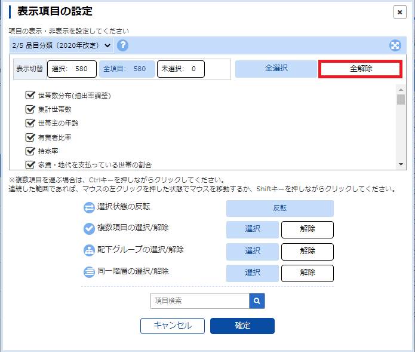

<br>

### 1.11. コメを選択
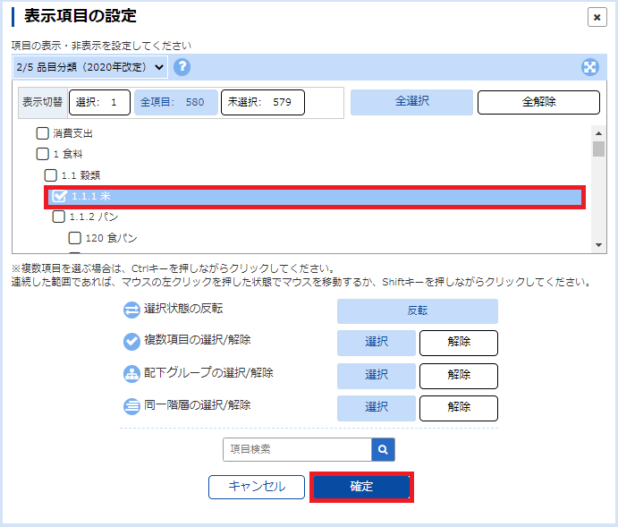

<br>

### 1.12. 表示項目選択タブ押下
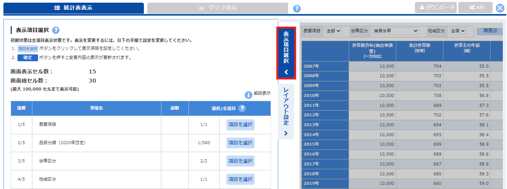

<br>

### 1.13. 世帯区分を単身世帯または単身(勤労者)世帯に選択して再表示ボタン押下
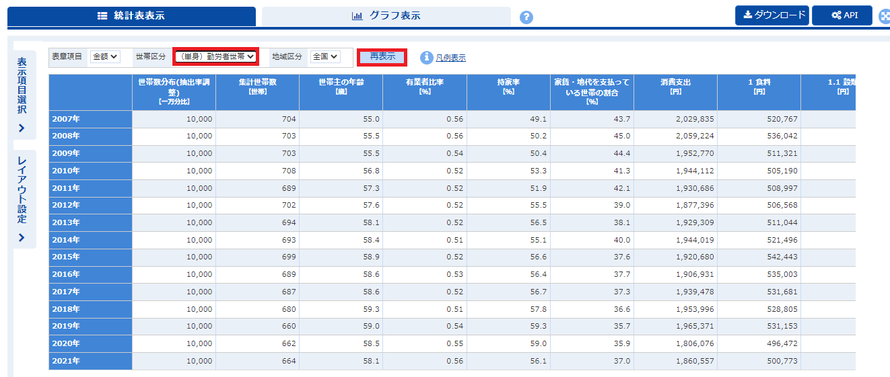

<br>

### 1.14. 目的の単身世帯の年間のコメ消費量(金額)を確認後にAPIボタン押下
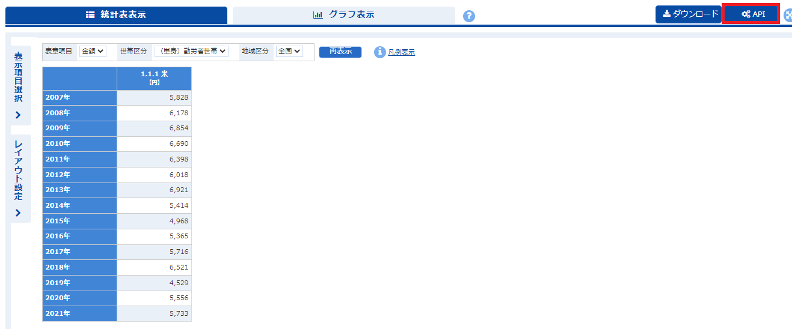

<br>

### 1.15. CSV形式に選択後にAPIリクエストURLを保存して閉じる
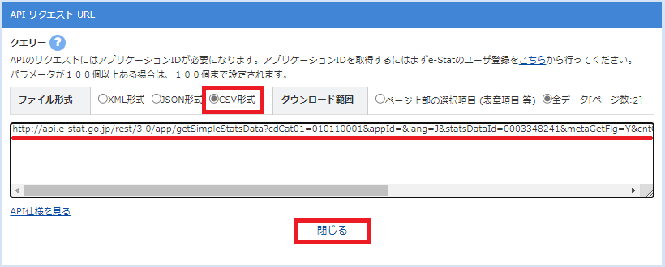

<br>

## 2. コマンドプロンプトで環境変数を指定
```
setx APP_ID [ESTAT発行のAPP-ID]
```

## 3. APIリクエストURLを元にソース記述
ノートブックファイルを参照

<br>

## 4. ノートブックファイル実行
統計情報のCSV出力が行われる

<br>

## 5. CSVファイル確認
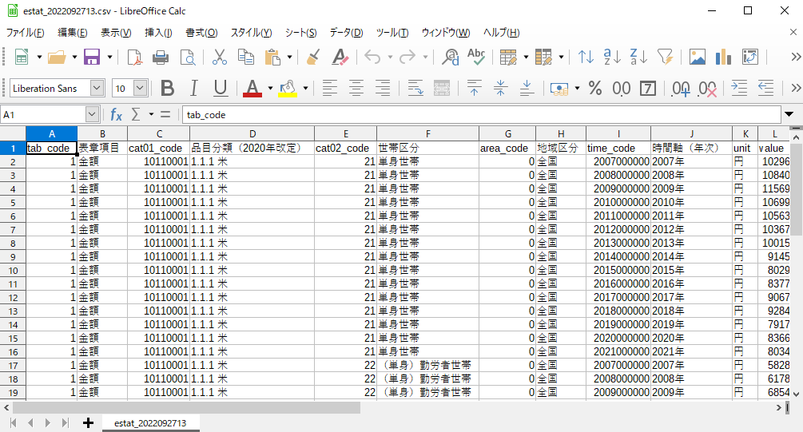
